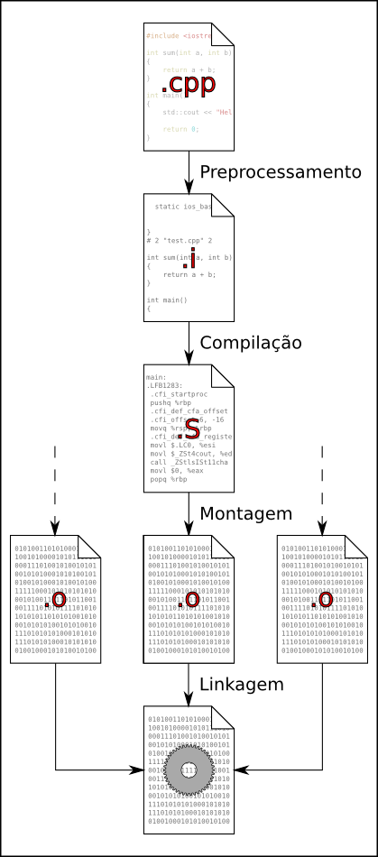

Compilação
===

A próxima etapa é a de compilação, que traduz o código C++ em código assembly. Esse código, em conjunto com vários
outros arquivos, são linkados, produzindo assim o executável final (ou biblioteca).

Essa é uma das partes do livro que depende de ambiente (Sistema Operacional, compilador...) para que você possa
reproduzir. Apenas para fins didáticos, essa seção utilizará o Sistema Operacional Linux e o compilador GCC, invocado
pela linha de comando (terminal). Considere o seguinte programa:

`main.cpp`
```cpp
#include <iostream>

double f(double x)
{
    return 3*x*x + 2*x - 1;
}

double g(double x)
{
    return 3*f(x + 1.);
}

int main()
{
    std::cout << f(3.) << std::endl;
    std::cout << g(4.) << std::endl;
}
```

Pela linha de comando, utilizando GCC, é possível compilar o programa acima invocando o comando `g++ main.cpp`, o que
produz um executável de nome `a.out`. Imagine, porém, que o código do `main.cpp` começa a crescer, e está agora com 1000
linhas de código. Outras pessoas começaram a trabalhar no mesmo projeto. Não seria fácil manter e evoluir o programa
em um só arquivo grande com várias pessoas mexendo nele todos os dias.
Essa é uma das motivações para separar o projeto em vários arquivos. Move-se, portanto, a implementação de `f` e de `g`
para os arquivos `f.hpp` e `g.hpp`:

`main.cpp`
```cpp
#include <iostream>
#include "f.hpp"
#include "g.hpp"

int main()
{
    std::cout << f(3.) << std::endl;
    std::cout << g(4.) << std::endl;
}
```


`f.hpp`
```cpp
double f(double x)
{
    return 3*x*x + 2*x - 1;
}
```

`g.hpp`
```cpp
#include "f.hpp"

double g(double x)
{
    return 3*f(x + 1.);
}
```

Compilar esse pequeno exemplo produz a seguinte mensagem de erro:

```
$ g++ main.cc 
In file included from g.hpp:1,
                 from main.cc:3:
f.hpp:1:8: error: redefinition of ‘double f(double)’
    1 | double f(double x)
      |        ^
In file included from main.cc:2:
f.hpp:1:8: note: ‘double f(double)’ previously defined here
    1 | double f(double x)
      |        ^
```

Conforme explicado no capítulo anterior, a ausência das _include guards_ pode ser perigoso, como é o presente caso.
Isso porque tanto `main.cpp` quanto `g.hpp` incluem `f.hpp`, gerando uma redefinição da função `f`.
Isso fica bem claro quando verificamos o output da etapa de pré-processamento isoladamente com `g++ -E main.cc`.
O problema pode ser resolvido, incluindo os _include guards_ (#ifndef ... #define ... #endif), conforme código abaixo:

`f.hpp`
```cpp
#ifndef __F_HPP
#define __F_HPP

double f(double x)
{
    return 3*x*x + 2*x - 1;
}

#endif
```

`g.hpp`
```cpp
#ifndef __G_HPP
#define __G_HPP

#include "f.hpp"

double g(double x)
{
    return 3*f(x + 1.);
}

#endif
```

O novo código compila e roda normalmente, porém, não é recomendado manter as implementações das funções em headers files (arquivos `.hpp`),
pois a medida que o projeto cresce, o processo de compilação começará a ficar lento. Além disso, uma modificação em
qualquer header file ocasionará na recompilação de todo o projeto (Ou seja, ocasionaria em um "rebuild").

Dessa forma, é comum separar a declaração das classes e funções em arquivos `hpp` e a definição das mesmas em arquivos
`cpp`, exceto aqueles que contém templates. Nosso exemplo segue da seguinte forma:

`main.cc`

```cpp
#include <iostream>
#include "f.hpp"
#include "g.hpp"

int main()
{
    std::cout << f(3.) << std::endl;
    std::cout << g(4.) << std::endl;
}
```

`f.hpp`
```cpp
#ifndef __F_HPP
#define __F_HPP

double f(double x);

#endif
```

`f.cc`
```cpp
#include "f.hpp"

double f(double x)
{
    return 3*x*x + 2*x - 1;
}
```

`g.hpp`
```cpp
#ifndef __G_HPP
#define __G_HPP

#include "f.hpp"

double g(double x);

#endif
```

`g.cc`
```cpp
#include "g.hpp"

double g(double x)
{
    return 3*f(x + 1.);
}
```

Para que os novos arquivos estejam acessiveis no momento da compilação, o processo de compilação precisa ser alterado.
Precisamos, agora, colocar todos os arquivos `.cpp` para que sejam compilados e _linkados_ juntos:

`g++ f.cc g.cc main.cc`

Conforme notado anteriormnete, nos `#includes` locais, utiliza-se aspas duplas para incluir os arquivos de projeto, e
utilizamos `<` e `>` para incluir arquivos de sistema (`iostream`, por exempo). Arquivos incluídos com aspas duplas são
arquivos presentes da mesma pasta em relação ao arquivo que está sendo incluído. Arquivos incluidos com `<` e `>` são
buscados em uma lista pré-definida de pastas, no processo de compilação. É possível adicionar uma pasta nessa lista,
utilizando a opção de compilação `-I [caminho]`. De fato, não é raro encontrar projetos que acabam adicionando a pasta
corrente (local) nessa lista e utilizando apenas `<` e `>` em todos os includes. Isso pode ser uma vantagem, por exemplo,
quando estamos reestruturando o projeto e movendo arquivos. Trocando todos os includes do nosso exemplo para atuarem
com `<` e `>`, o processo de compilação se tornaria-se `g++ f.cc g.cc main.cc -I..`.

O processo de compilação da forma como está invocado acima, na verdade inclui o processo de pré-processamento (que já
vimos) e o processo de linkagem. É possível invocar o compilador individualmente para cada arquivo arquivo `.cpp` e,
posteriormente, invocar o processo de linkagem separadamente. Faremos isso para fins didáticos:

```
g++ -c g.cc -I.
g++ -c f.cc -I.
g++ -c main.cc -I.
```

Esses comandos geram os arquivos chamados _código objeto_: `g.o`, `f.o` e `main.o`. Esses arquivos não são executáveis.
Para finalizar o processo de compilação, é necessário invocar (Não estou utilizando diretamente o _linker_ nesse caso): `g++ f.o g.o main.o`.
Uma representação do que foi feito é mostrada abaixo:



É importante ter em mente essas duas etapas como processos separados.
Erros de compilação (sintaxe e pré-processamento, por exemplo) acontecerão mesmo quando você tentar compilar o arquivo
isoladamente. Erros de _linkagem_ (tais como `undefined reference`) acontecerão apenas quando você tentar compilar todos
os arquivos em conjunto ou quando você estiver executando a etapa de linkagem manualmente.

